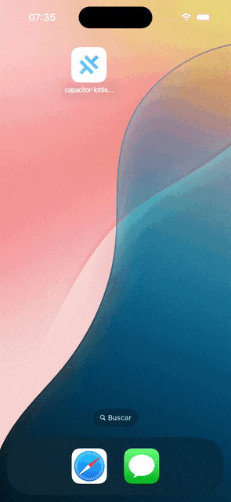
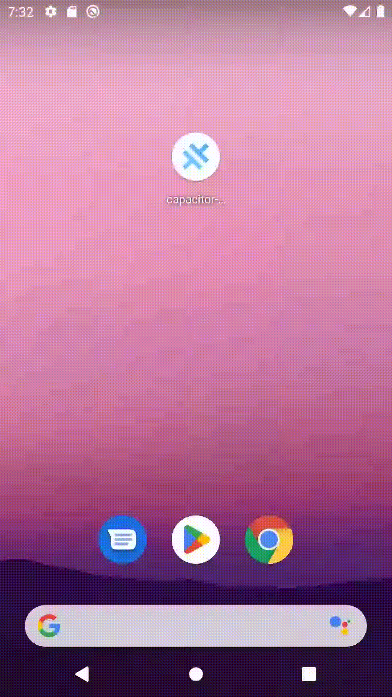

<p align="center"><br></p>
<h3 align="center">Lottie Splash Screen</h3>
<p align="center"><strong><code>capacitor-lottie-splash-screen</code></strong></p>
<p align="center">
  Lottie Splash Screen plugin for Ionic Capacitor
</p>

<p align="center">
  
  <a href="https://www.npmjs.com/package/capacitor-lottie-splash-screen"></a>
  <a href="https://www.npmjs.com/package/capacitor-lottie-splash-screen"></a>
  <a href="https://www.npmjs.com/package/capacitor-lottie-splash-screen"></a>
<!-- ALL-CONTRIBUTORS-BADGE:START - Do not remove or modify this section -->
<a href="#contributors-"></a>
<!-- ALL-CONTRIBUTORS-BADGE:END -->
<br />
<a href="https://www.buymeacoffee.com/ludufre"></a>
</p>

## Preview

<div align="center">
  
  <br>
  
  [Angular Example](./example-app/README.md)
</div>

## Maintainers

| Maintainer             | GitHub                                | Social                            | LinkedIn                                                           |
| ---------------------- | ------------------------------------- | --------------------------------- | ------------------------------------------------------------------ |
| Luan Freitas (ludufre) | [ludufre](https://github.com/ludufre) | [@ludufre](https://x.com/ludufre) | [Luan Freitas](https://www.linkedin.com/in/luan-freitas-14341687/) |

## Installation

```bash
npm install capacitor-lottie-splash-screen
npx cap sync

# or using pnpm
pnpm add capacitor-lottie-splash-screen
npx cap sync
```

Add to `capacitor.config.ts` or `capcitor.config.json`

```typescript
const config: CapacitorConfig = {
  ...
  LottieSplashScreen: {
    enabled: true, // Can be disabled and called manually with .show() & .hide(). Can coexist with @capacitor/splash-screen
    animationLight: "public/assets/[path/to.json]", // Required!
    animationDark: "public/assets/[path/to.json]", // Optional (default: same as animationLight)
    backgroundLight: "#FFFFFF", // Optional (default: #FFFFFF)
    backgroundDark: "#000000", // Optional (default: #000000)
    autoHide: false, // Hide after animation ends - Optional (default: false)
    loop: false, // Enable animation loop - Optional (default: false)
  },
  SplashScreen: {
    launchAutoHide: true, // Disables @capacitor/splash-screen
    launchShowDuration: 0
  },
  ...
};
```

### **⚠️ Important Notes!**

- **autoHide true:**

  - The splash screen will hide automatically after the animation ends.
  - If you call `LottieSplashScreen.appLoaded()` _before_ the animation ends, it will wait until the animation finishes.
  - Calling `LottieSplashScreen.hide()` will hide it immediately without waiting for the end.

- **autoHide false (default):**

  - You must call `LottieSplashScreen.appLoaded()` to hide the splash screen after your app is loaded. If you do not call it, the splash screen will remain visible indefinitely with last frame displayed.

- **Loop behavior:**

  - If `loop` is `true`, the animation will continue looping until `LottieSplashScreen.appLoaded()` is called (which stops it immediately).
  - To play the animation only once, set `loop` to `false` (default behavior).

- **Manual display:**
  - When calling `LottieSplashScreen.show()`, the splash screen appears and starts playing the animation immediately.
  - You must call `LottieSplashScreen.hide()` to remove the splash screen; the animation end is not waited for.

## Example

See the [Angular Example](./example-app/README.md) for a complete example of how to use the plugin in an Ionic Angular application.

Call `LottieSplashScreen.appLoaded();` when the App is ready.

```typescript
// Splash screen will only close after this call and the animation ends unless you set "autoHide: true" which will hide it automatically.
this.platform.ready().then(() => {
  LottieSplashScreen.appLoaded();
}

// Another way with Angular provideAppInitializer() (reaplces APP_INITIALIZER) to ensure the app is loaded before proceeding
bootstrapApplication(AppComponent, {
  providers: [
    ...,
    provideAppInitializer(async () => {
      await inject(...).init(); // Your initialization logic here
      await LottieSplashScreen.appLoaded();
    }),
    ...
  ],
})...

// Programmatically show the splash screen
LottieSplashScreen.show();

// Programmatically hide the splash screen (without waiting for animation end)
LottieSplashScreen.hide();

// Check if the splash screen is animating
LottieSplashScreen.isAnimating().then((result) => {
  console.log('Is animating:', result.isAnimating);
});

// Add a listener for the animation end event
LottieSplashScreen.addListener('onAnimationEnd', () => {
  console.log('Animation ended');
});
```

## Highly Inspired / Credits

- https://github.com/Get-Local/capacitor-lottie-splash-screen
- https://github.com/MorphoodInc/capacitor-lottie-splash-screen
- https://github.com/muhammadosmanali/capacitor-lottie-splash-screen

<a href="https://www.buymeacoffee.com/ludufre"></a>

## API

<docgen-index>

- [`appLoaded()`](#apploaded)
- [`show()`](#show)
- [`hide()`](#hide)
- [`isAnimating()`](#isanimating)
- [`addListener('onAnimationEnd', ...)`](#addlisteneronanimationend-)
- [Interfaces](#interfaces)

</docgen-index>

<docgen-api>
<!--Update the source file JSDoc comments and rerun docgen to update the docs below-->

### appLoaded()

```typescript
appLoaded() => void
```

Indicate to the plugin that the app has loaded.

Run as early as possible when your app is loaded.
This will ensure that on animation end the layer of the splash screen is removed
and touch interactions will go to the app.

If `loop` is set to `true` the splash screen will be terminated immediately.

---

### show()

```typescript
show() => void
```

Show the splash screen programatically.

---

### hide()

```typescript
hide() => void
```

Hide the splash screen.

This will hide the splash screen without waiting for animation end.

---

### isAnimating()

```typescript
isAnimating() => Promise<{ isAnimating: boolean; }>
```

Check if the splash screen is currently animating.

**Returns:** <code>Promise&lt;{ isAnimating: boolean; }&gt;</code>

---

### addListener('onAnimationEnd', ...)

```typescript
addListener(eventName: 'onAnimationEnd', listenerFunc: () => void) => Promise<PluginListenerHandle>
```

Add a listener for the 'onAnimationEnd' event.

This event is triggered when the splash screen animation ends.

| Param              | Type                          |
| ------------------ | ----------------------------- |
| **`eventName`**    | <code>'onAnimationEnd'</code> |
| **`listenerFunc`** | <code>() =&gt; void</code>    |

**Returns:** <code>Promise&lt;<a href="#pluginlistenerhandle">PluginListenerHandle</a>&gt;</code>

---

### Interfaces

#### PluginListenerHandle

| Prop         | Type                                      |
| ------------ | ----------------------------------------- |
| **`remove`** | <code>() =&gt; Promise&lt;void&gt;</code> |

</docgen-api>
