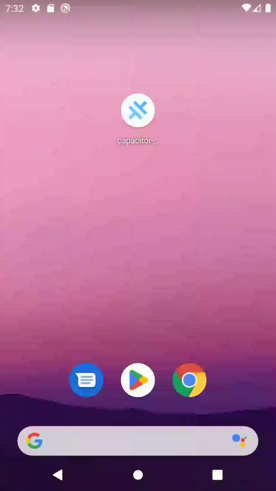

# Capacitor Lottie Splash Screen Example

This is an example project for the Capacitor Lottie Splash Screen plugin.

## Usage

```bash
pnpm install

# For iOS
ionic cap run ios

# For Android
ionic cap run android
```

## Example Animation

You can find an example Lottie animation in the `assets` folder of this project. Make sure to update the `lottieAnimation` path in ìonic.capacitor.ts` to your correct animation file.

See [README.md](https://github.com/ludufre/capacitor-lottie-splash-screen/blob/main/README.md) for more details on how to use the plugin.

## Preview

<div align="center">
  
  <br>
</div>
